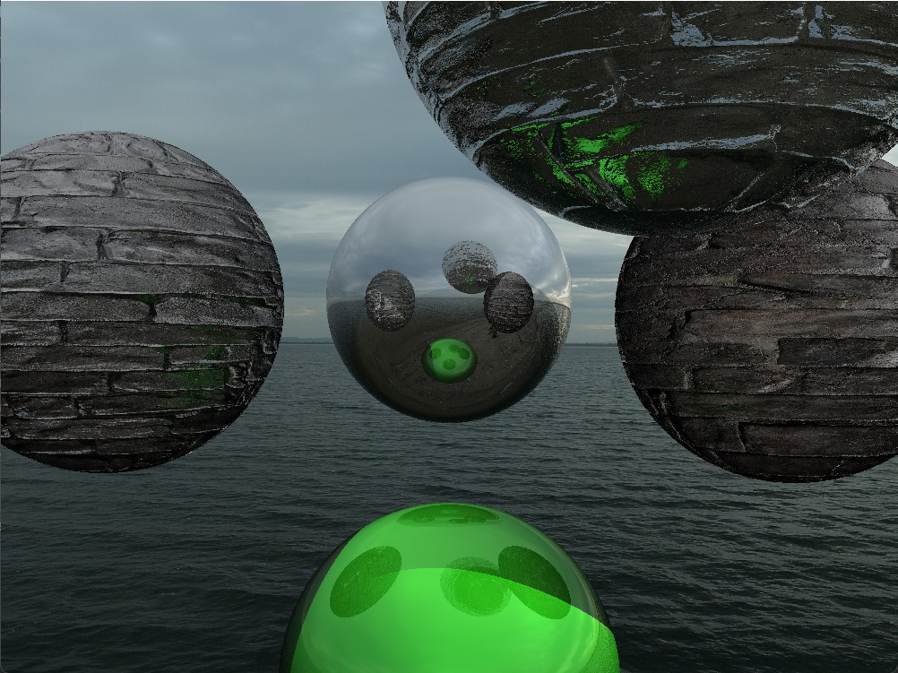
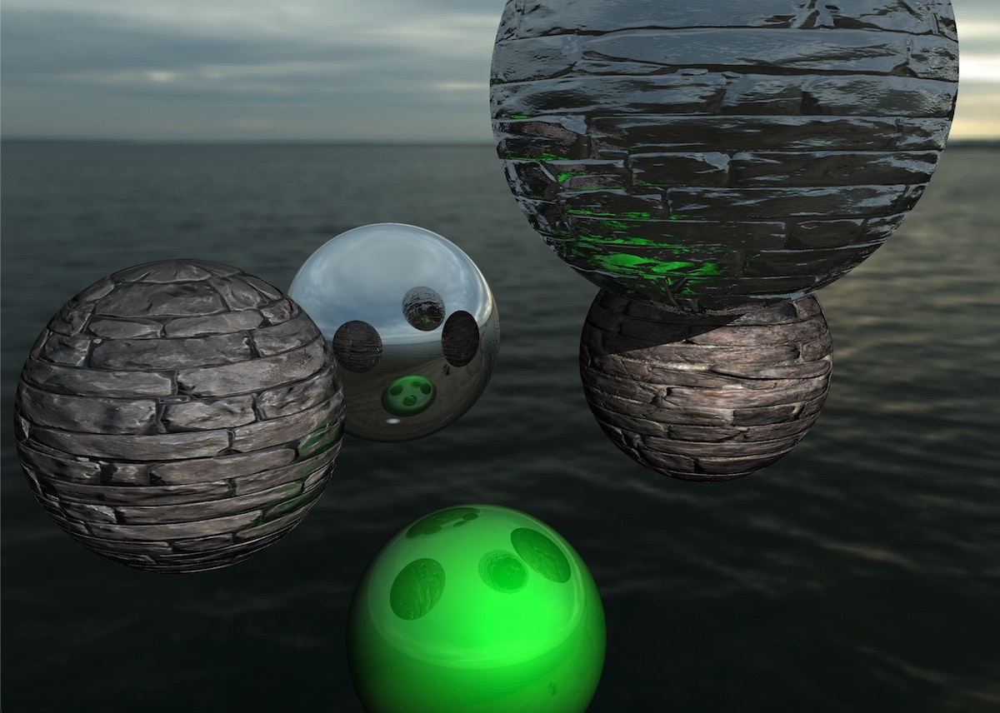

# Simple raytracer written in Rust

First attempt..

And after fixing the normals and adding bilinear interpolation to the texture sampling:

The picture of the ocean is a static skybox. 
The 3D objects in this scene are the 5 spheres.

### Scope of this project
Fun side project to get involved with Rust.

As this is my first Rust code you should not use this as a reference. 
Please check the concepts and the used data structures on other sources if you do so anyway.

### Features
* single threaded
* (reflective) materials
* normal maps
* spheres

###